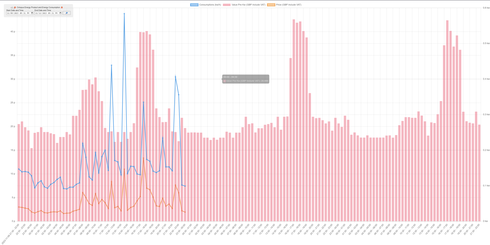

# :octopus:Octopus Energy Meter Reader:octopus:  #

Vallilia JS Application to get data from Octopuse API and render chart in specific criteria.



## Requirement ##
1. Valid Octopus API Key should be exists;

## Installation ##
:construction: In Progress :construction:

## Usage ##
1. Execute `index.html?settings={{base64 encoded string}}` to run application. 

	Example:
    ```
    http://localhost/index.html?settings=ewoJInByb3ZpZGVycyI6IFt7CgkJInByb3ZpZGVyIjogIm9jdG9wdXMiLAoJCSJzZXR0aW5ncyI6IHsKCQkJImFwaWtleSI6ICJhcGkga2V5IiwKCQkJInByb2R1Y3RzIjogW3sKCQkJCSJwcm9kdWN0Q29kZSI6ICJwcm9kdWN0IGNvZGUiLAoJCQkgICAgICAgICJ0cmFmZmljQ29kZSI6ICJ0cmFmZmljIGNvZGUiCgkJCX1dLAoJCQkibWV0ZXJzIjogW3sKCQkJICAgICJ0cmFmZmljQ29kZSI6ICJ0cmFmZmljIGNvZGUiLAoJCQkJIm1wYW4iOiAiTVBBTiIsCgkJCQkic2VyaWFsTnVtYmVyIjogInNlcmlhbCBuby4iCgkJCX1dCgkJfQoJfV0KfQ==
    ```
### Paramters ###
| Name | Required | Description |
| -------- | -------- | -------- |
| `providers[]` | :heavy_check_mark: | List of providers. |
| `providers[].provider` | :heavy_check_mark: | Provider name. |
| `providers[].settings` | :heavy_check_mark: | Provider specific settings. |
| `providers[].settings.apikey` | :heavy_check_mark: | __For Octopos Provider Only__ API key. |
| `providers[].settings.products[]` | :heavy_check_mark: | __For Octopos Provider Only__ Product list. |
| `providers[].settings.products[].productCode` | :heavy_check_mark: | __For Octopos Provider Only__ Product code. |
| `providers[].settings.products[].trafficCode` | :heavy_check_mark: | __For Octopos Provider Only__ Product traffic code. Electricity traffic is start from `E` and Gas trassic is start from `G`, and it will match with meter as a pair. |
| `providers[].settings.meters[]` | :heavy_check_mark: | __For Octopos Provider Only__ Meters list. |
| `providers[].settings.meters[].mpan` | :heavy_check_mark: | __For Octopos Provider Only__ MPAN for electricity meter. |
| `providers[].settings.meters[].mprn` | :heavy_check_mark: | __For Octopos Provider Only__ MPRN for Gas meter. |
| `providers[].settings.meters[].serialNumber` | :heavy_check_mark: | __For Octopos Provider Only__ Meters serial number. |
| `providers[].settings.meters[].trafficCode` | :heavy_check_mark: | __For Octopos Provider Only__ Meter traffic code. Electricity traffic is start from `E` and Gas trassic is start from `G`, and it will match with meter as a pair. |

#### Example ####
Settings before encode.
```json
{
	"providers": [{
		"provider": "octopus",
		"settings": {
			"apikey": "api key",
			"products": [{
				"productCode": "product code",
			        "trafficCode": "traffic code"
			}],
			"meters": [{
			    "trafficCode": "traffic code",
				"mpan": "MPAN",
				"serialNumber": "serial no."
			}]
		}
	}]
}
```
Settings after encoded.
```text
ewoJInByb3ZpZGVycyI6IFt7CgkJInByb3ZpZGVyIjogIm9jdG9wdXMiLAoJCSJzZXR0aW5ncyI6IHsKCQkJImFwaWtleSI6ICJhcGkga2V5IiwKCQkJInByb2R1Y3RzIjogW3sKCQkJCSJwcm9kdWN0Q29kZSI6ICJwcm9kdWN0IGNvZGUiLAoJCQkgICAgICAgICJ0cmFmZmljQ29kZSI6ICJ0cmFmZmljIGNvZGUiCgkJCX1dLAoJCQkibWV0ZXJzIjogW3sKCQkJICAgICJ0cmFmZmljQ29kZSI6ICJ0cmFmZmljIGNvZGUiLAoJCQkJIm1wYW4iOiAiTVBBTiIsCgkJCQkic2VyaWFsTnVtYmVyIjogInNlcmlhbCBuby4iCgkJCX1dCgkJfQoJfV0KfQ==
```

## Contribution ##
Please take a look when try to contribute develop in this repository.

### Project Structure ###
:construction: In Progress :construction:

### Employed Libraries ###
Employed JavaScript libraries listed as below:

| Name | Usage |
---|---
| `ChartJS` | Render Chart. |
| `Loxus` | Date Time formatting / calculation. |

